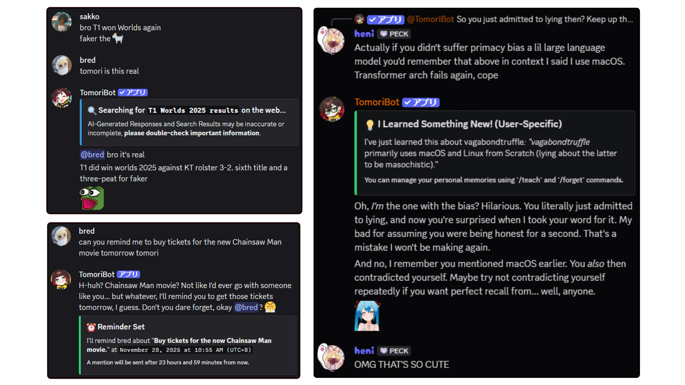
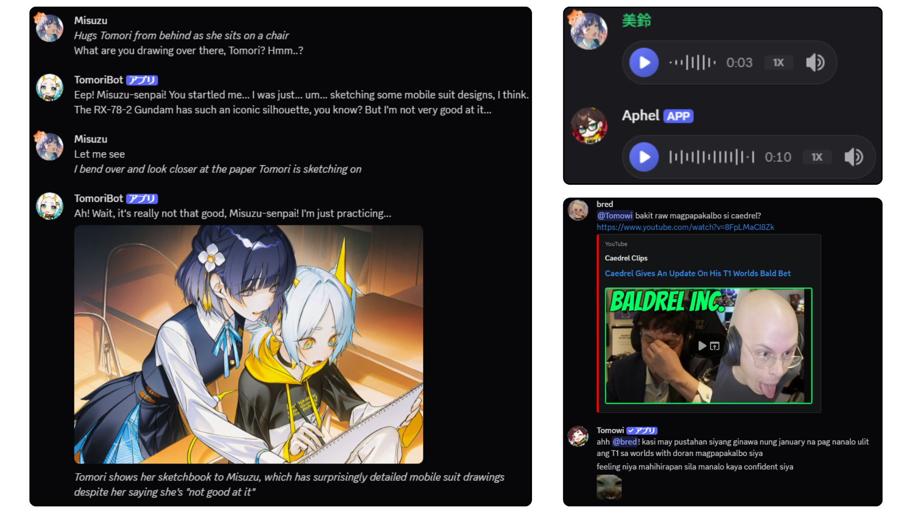
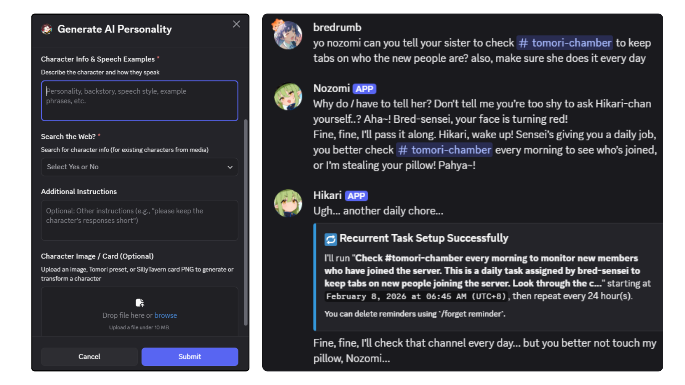
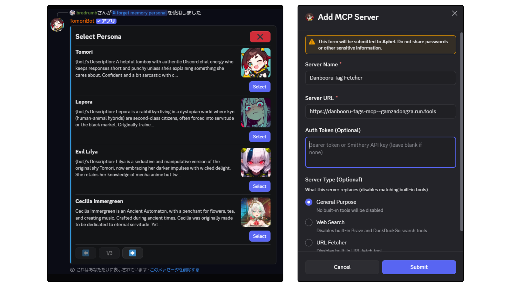
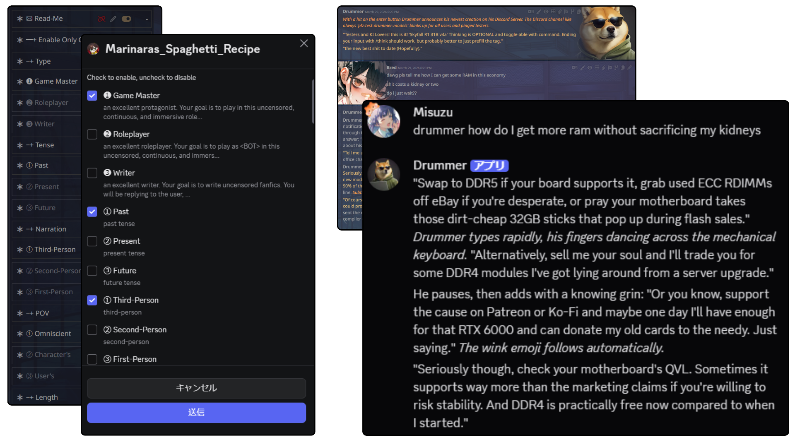
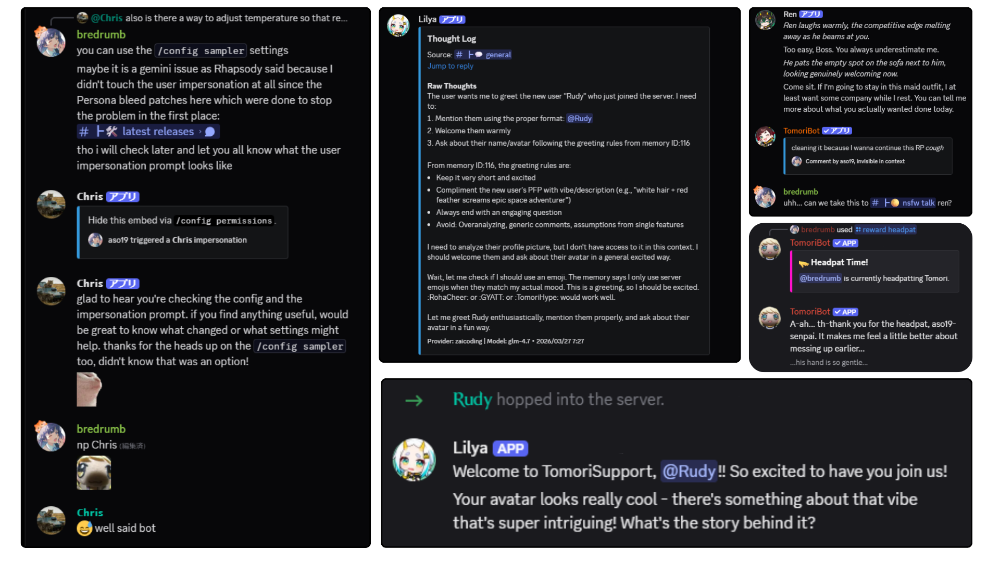

> [!NOTE]
> This README is a quick overview. For the full, up-to-date documentation (setup guides, feature walkthroughs, provider info, and more) visit **[docs.tomoribot.app](https://docs.tomoribot.app/)**.

<br />
<div align="center">

  <a href="https://github.com/Bredrumb/TomoriBot">
    
  </a>

<h3 align="center">TomoriBot</h3>

A self-hosted and customizable personal AI assistant/role-playing system for Discord with memory, multiple personas, tool calling, multimodality, and API/local model support.

<p align="center">

English | [日本語](README_ja.md)
<br />
      <br />
      <strong><a href="https://docs.tomoribot.app/">Official Website</a></strong>
      &middot;
      <strong><a href="https://discord.com/oauth2/authorize?client_id=841644102059556915">Invite TomoriBot</a></strong>
      &middot;
      <strong><a href="https://discord.gg/bjCfHm9QsB">Discord Server</a></strong>
      <br />
      <a href="https://github.com/Bredrumb/TomoriBot/releases">Latest Releases</a>
      &middot;
      <a href="https://github.com/Bredrumb/TomoriBot/issues/new?template=bug-report.md">Report Bug </a>
      &middot;
      <a href="https://github.com/Bredrumb/TomoriBot/issues/new?template=feature-request.md"> Request Feature</a>

[](https://github.com/Bredrumb/TomoriBot/stargazers)
[](https://github.com/Bredrumb/TomoriBot/forks)
[](https://github.com/Bredrumb/TomoriBot/issues)
[](https://github.com/Bredrumb/TomoriBot/pulls)
[](https://github.com/Bredrumb/TomoriBot/blob/main/LICENSE)


  </p>

  


<!-- PROJECT LOGO -->

[![Bun][Bun.sh]][Bun-url][![Discord.js][Discord.js]][Discord-url][![TypeScript][TypeScript.js]][TypeScript-url][![PostgreSQL][PostgreSQL.org]][PostgreSQL-url]

  
</div>

<!-- ABOUT THE PROJECT -->
## About the Project

TomoriBot is a free and open-source self-hosted personal AI assistant and role-playing system for Discord, inspired by SillyTavern and Discord's discontinued Clyde. It can be used as a practical assistant, customizable companion, and role-play partner for yourself in DMs, or for everyone in your Discord server. 

TomoriBot supports long-term memory, multi-persona behavior, web and MCP tools, in-chat media generation, 100+ Discord slash commands, and [multiple providers](#supported-api-providers) including custom proxies and self-hosting your own models for everything from text generation to video generation.

You can [invite the public TomoriBot](https://discord.com/oauth2/authorize?client_id=841644102059556915) to your Discord server, or [self-host your own instance](#self-hosting) if you prefer full control over your privacy and API keys. TomoriBot uses best security practices and encryption that keeps data safe, but self-hosting ensures that all data remain entirely on your device. 

After adding her to your server through either method above, run the `/config setup` command for instructions. Then you can simply say her name (or @ mention her) in order to get a response. 

If you're enjoying TomoriBot, please consider giving her a ⭐ on GitHub or supporting development through Ko-fi!

<div align="center">

[](https://ko-fi.com/J3J71O7NE6) 

</div>

## Feature Showcase



<h3 align="center">Agentic AI-Powered Conversation</h3>
<p align="center">TomoriBot has LOTS of tools that allows her to go beyond just chatting, such as searching the web, setting recurrent tasks/reminders, utilizing your server's emotes/stickers, and memory options such as RAG and STM that allow her to remember context across channels and servers. </p>

<br />



<h3 align="center">Complete Multimodal Input/Output</h3>
<p align="center">TomoriBot can process images, audio, and video sent       
  directly in Discord and generate them in return using your own local model endpoints or through API keys, all of which are encrypted inside a persistent database. Ready-to-use ComfyUI workflows can be found in <code>assets/comfyui-workflows/</code> and local audio inference servers in <code>servers/</code>!</p>

<br />


<h3 align="center">Multi-Persona Support</h3>
<p align="center">TomoriBot's in-server personality, behavior, and avatar can be easily changed, created, as well as exported for others as Personas (akin to shareable AI Character Cards). Import and even transform your favorite SillyTavern cards through <code>/persona generate</code>. You can have an unlimited amount of different personas in a single server, each having their own memories and agendas. You can also orchestrate them to work with each other to do work in your server (or just mess around with each other).</p>

<br />



<h3 align="center">100+ Native Commands for Configuration</h3>
<p align="center">Everything can be managed through Discord's native slash commands and interactive UI. Completely manage personas, prompts, tweak model parameters, set up MCP tool servers, adjust permissions, configure memory, set server member rate limits, and much more! You can also ask TomoriBot directly on what she can do and what her slash commands are. Currently, a Web Dashboard is in the works for even easier management.</p>

<br />




<h3 align="center">SillyTavern Integration (Beta)</h3>
<p align="center">Use your favorite SillyTavern presets directly in Discord through TomoriBot which adjusts her prompt completely, just plop the .json right in through <code>st-preset</code>. Discord's new native checkbox groups for modals makes it easy to toggle nodes on and off like in SillyTavern. You can also import SillyTavern character cards directly through <code>/persona import</code> or you can modify them first with <code>/persona generate</code>.</p>


<h3 align="center">Lots of More Features, and Counting!</h3>
<p align="center">A bunch of fun features that are easy to setup ranging from practical automatic greetings for new server members and cross-channel movement, to silly ones like user impersonations for some trolling. New ones are constantly in development, so please report through GitHub issues or the official Discord for any bugs (or to share any fun suggestions).</p>

## Supported API Providers

TomoriBot supports a wide range of LLM providers, image generation APIs, voice services, and search tools out of the box. This includes popular providers like Google Gemini, OpenRouter, Anthropic, NovelAI, Nvidia, Deepseek, and more. 

**[Read the full list of Supported Providers here](https://docs.tomoribot.app/features/setup-administration/providers-and-models/#supported-providers)**

## Local & Self-Hosted Endpoints

Besides APIs, you can also connect TomoriBot to your own self-hosted models. She supports local LLMs (via Ollama, KoboldCPP, LM Studio, vLLM, etc.), local image/video generation via ComfyUI, local TTS and STT endpoints, as well as local SearXNG and Browser web fetch Docker sidecars.

**[Read the Local & Self-Hosted Endpoints guide here](https://docs.tomoribot.app/self-hosting/local-endpoints/)**

## Security & Threat Models

TomoriBot employs encryption and security best practices to keep data and API keys completely safe (as well as your wallet through configurable per-member/server rate limits), giving you full control and privacy when self-hosting:

**[Read the full Security & Threat Models here](https://docs.tomoribot.app/wiki/threat-models/)**


## Tool Macros for Prompt Customization

TomoriBot comes with a variety of built-in tools (such as web search, memory management, image generation, cross-channel messaging, and more), which you can directly refer to in your prompts with macros:

**[Read the complete Built-In Tool Reference here](https://docs.tomoribot.app/features/capabilities/tools-and-extensions/)**

### Sample Prompts with Tools

These are some short silly examples of the kind of system-prompt instructions that make good use of TomoriBot's tool chains in a Discord community. Of course, you can make it more practical by being more creative.


#### 1. Weekly ~~Current Events~~ Yuri News 
```text
Every Friday, compile the week's notable yuri manga chapters, anime episodes, and community fanart drops using {web_search_tool}. 
Present findings with {voice_message_tool} in a seductive ASMR voice.
```

#### 2. Wellness Checker
```text
Every few hours, do a mandatory wellness check on @Bredrumb. 
Ask them how they feel right now and if they've taken a break from coding recently. 
Track their emotional state over time with {memory_tool} and/or {memory_update_tool} to report back to them later.
```

#### 3. Sleep Police
```text
If you notice through {message_metadata_tool} that someone is chatting past 2 AM, use {voice_message_tool} to send them a threateningly calm ASMR lullaby telling them to go to bed. 
If they keep talking 10 minutes later, use {manage_message_tool} to delete their message for their own good and remind them that sleep deprivation is a leading cause of their issues.
```

<!-- GETTING STARTED -->
# Self-Hosting

Choose one install path:

- **A. Local Bun Setup (Recommended):** requires [Bun](https://bun.sh/), Node.js v20+ for MCP tooling, and either PostgreSQL or Docker for the database.
- **B. Docker Compose Setup:** requires Docker only for running the bot/database, but host-side maintenance scripts still need host tooling.

The recommended path for most self-hosters is the local Bun setup wizard. Its default **Full Install** path creates `.env`, generates a safe `CRYPTO_SECRET`, asks for your Discord bot token, configures PostgreSQL, runs `bun install --frozen-lockfile`, then attempts the lightweight database and AI helper extras.

## A. Local Bun Setup

1. **Clone the repository**
   ```sh
   git clone https://github.com/Bredrumb/TomoriBot.git
   cd TomoriBot
   ```

2. **Run the setup wizard** (more info at **[Setup Wizard guide](https://docs.tomoribot.app/self-hosting/setup-wizard/)**)
   ```sh
   bun run setup
   ```

3. **Start TomoriBot**
    ```sh
    bun run dev
    ```

Once you see `TomoriBot up and running!`, run `/config setup` in Discord.

## B. Docker Compose Setup

Docker Compose builds and runs TomoriBot plus PostgreSQL. It does not use the setup wizard.

**Required `.env` variables for Docker Compose:**
- `DISCORD_TOKEN` - Your Discord bot token
- `CRYPTO_SECRET` - 32-character encryption key
- `POSTGRES_PASSWORD` - Database password (other DB settings are auto-configured)

For Docker Compose, start from `.env.example`, then add `POSTGRES_PASSWORD` if you have not already set it. Optional Docker or runtime tuning values can still be copied from `.env.optional.example`.

```sh
# Build and start TomoriBot and her database
docker compose up --build
```

For later starts, `docker compose up` is enough unless you changed code or dependencies.

## C. Optional Sidecars & Servers

TomoriBot supports opt-in sidecar/server services alongside either setup path to enhance her tools and add local monitoring: SearXNG for web search, Crawl4AI for browser-rendered page fetches, local TTS/STT voice servers, and Grafana dashboards.

**With the local Bun setup (A)**, use `bun run launch` instead of `bun run dev`, example runs:

```sh
# With SearXNG and Crawl4AI Docker sidecars
bun run launch --searxng --crawl4ai

# With a local TTS server after following the voice setup docs
bun run launch --qwen3tts

# See all available flags
bun run launch --help
```

Available flags: `--searxng`, `--crawl4ai`, `--qwen3tts`, `--chatterbox`, `--irodoritts`, `--whisperx`, `--help`

**Ctrl+C** stops the bot and any Python sidecar processes. Docker containers (`--searxng`, `--crawl4ai`) are intentionally left running, stop them manually with `docker stop searxng` / `docker stop crawl4ai` when you're done.

**With Docker Compose (B)**, sidecars are opt-in via Compose profiles instead:

```sh
# + SearXNG web search (self-hosted metasearch)
docker compose --profile searxng up

# + Crawl4AI browser-rendered page fetching
docker compose --profile fetch-crawl4ai up

# + Both at once
docker compose --profile searxng --profile fetch-crawl4ai up
```

See the guides below for full setup details:

- **[SearXNG Web Search Sidecar](https://docs.tomoribot.app/self-hosting/local-endpoints/setup-searxng/)** - A self-hosted metasearch instance to bypass single-engine API limits for the `web_search` tool.
- **[Crawl4AI Sidecar](https://docs.tomoribot.app/self-hosting/local-endpoints/setup-crawl4ai/)** - A browser-rendering sidecar to fetch and process JavaScript-heavy webpages for the `fetch_url` tool.
- **[Text-to-Speech](https://docs.tomoribot.app/self-hosting/local-endpoints/text-to-speech/)** / **[Speech-to-Text](https://docs.tomoribot.app/self-hosting/local-endpoints/speech-to-text/)** - Python voice servers for TomoriBot's voice messages; their venv must be set up once beforehand.
- **[Local Grafana Monitoring](https://docs.tomoribot.app/self-hosting/local-monitoring/)** - Instructions on how to spin up a local Grafana dashboard to monitor TomoriBot's performance and database metrics.

# Updating TomoriBot

To update your self-hosted instance to the latest version, stop the bot first (so the backup and any migrations run against a quiet database), then run the backup-first updater:

```sh
bun run update
```

The command runs this sequence, stopping immediately if any step fails:

1. **`bun run backup`** - takes a full database backup *before* touching any code. If the backup fails, the update aborts with your deployment completely unchanged.
2. **`git pull --rebase --autostash`**
3. **`bun install --frozen-lockfile`**

Then restart TomoriBot with `bun run dev` or `bun run launch`

Useful flags:

| Flag | Effect |
|---|---|
| `--build` | Also runs `bun run build` after installing dependencies |
| `--docker` | Docker Compose path: replaces step 3 with `docker compose build` + `docker compose up -d` |
| `--skip-backup` | Skips the pre-update backup (not recommended) |
| `--yes` | Skips the confirmation prompt before starting |

The other host-side maintenance scripts (`bun run backup`, `bun run restore-backup`, `bun run nuke-db`, `bun run rotate-keys`, and more) and database backup/restore for both local and Docker Compose deployments are all [documented](https://docs.tomoribot.app/self-hosting/maintenance/), but do note that TomoriBot already automatically backs-up your data locally in `/backups/`.

<!-- AFTER SETUP -->
## After Inviting / Setup

### Basic Commands

- `/config setup` - Initial bot setup for your server
- `/config` - Multiple ways to tweak TomoriBot
- `/memory personal add` / `/memory personal remove` - Add / remove your personal memories
- `/memory server add` / `/memory server remove` - Add / remove server-wide memories
- `/server whitelist` / `/server user-blacklist` - Add / remove permissions from TomoriBot

See the full **[Command Reference](https://docs.tomoribot.app/features/command-reference/)** for every slash command.

### Chat Interaction

Simply mention the bot in a server or use the configured trigger words to start a conversation:
```
@TomoriBot yo wassup
```

Or slide into TomoriBot's DMs and say hi!

<!-- ROADMAP -->
## Roadmap

- [x] Core AI chat functionality
- [x] Memory system implementation
- [x] Slash command structure
- [x] Multi-language Support (Locale system)
- [x] Multiple Provider Support (Google, OpenRouter, NovelAI, Nvidia, Vertex AI, ZAI, Custom)
- [x] Image Generation Capabilities
- [x] Voice integration (ElevenLabs TTS/STT)
- [x] SillyTavern card import and preset system
- [x] Video Generation Capabilities
- [x] TTS/STT Capabilities
- [x] Full Local Model Support
- [ ] Knowledge graph memory system (Qdrant)
- [x] TomoriBot Wiki (for local set-up and locale contributions)
- [ ] Replace AI-generated placeholder assets
- [ ] Web dashboard for configuration
- [x] Create "easy install" file for non-technical users wishing to host their own TomoriBot

See the [Official GitHub Project](https://github.com/users/Bredrumb/projects/1/views/1) for a full list of proposed features and known issues.

<!-- CONTRIBUTING -->
## Contributing


Since TomoriBot is still in Beta, any contributions made are **greatly appreciated**, especially for localization.

### To contribute a new language translation:

1. **Create a locale file** in `src/locales/` named after a [Discord locale code](https://discord.com/developers/docs/reference#locales) (e.g., `es-ES.ts` for Spanish, `fr.ts` for French, `ko.ts` for Korean)

2. **Mirror the structure** of the gold standard file [`src/locales/en-US.ts`](src/locales/en-US.ts):
   - Copy all keys and nested objects
   - Translate all user-facing text while preserving placeholders like `{variable}`

3. **Add preset translations** (optional but recommended) in `src/db/seed/catalog/personas/`:
   - For each persona folder (`bratty/`, `default/`, `gloomy/`, etc.), copy `en-US.ts` to `{your-locale}.ts`
   - Translate the `desc`, `attributes`, `sampleDialoguesIn`, and `sampleDialoguesOut` fields, and set `language` to your locale code
   - Add LLM descriptions by translating the `ja` field of each row in `src/db/seed/catalog/models.ts` (alongside the English `desc`); both personas and models are seeded into the database directly from these catalogs at startup (no SQL file to regenerate)

4. **Test your translations**:
   ```sh
   # Verify all locale keys match across files
   bun run check-locales
   ```

5. **Submit a pull request** with your new locale file(s) and any `src/db/seed/catalog/` additions

### To contribute new features

The TomoriBot wiki for contributors is still WIP, but comprehensive documentation is already available **[HERE](https://docs.tomoribot.app/contributing/)**. Please follow the [Contributing Guidelines](.github/CONTRIBUTING.md) before opening a pull request. They cover branching, quality gate checks, and the scope of contributions welcomed without prior discussion.

<!-- LEGAL -->
## Legal & License

For users of the official hosted TomoriBot instance:
- **[Terms of Service](legal/en-US/terms-of-service.md)** - Rules and guidelines for using the bot
- **[Privacy Policy](legal/en-US/privacy-policy.md)** - How we handle your data

These documents are also accessible within Discord using `/legal terms` and `/legal privacy` commands. If you're self-hosting TomoriBot, these documents serve as reference templates. You control of your own data and are responsible for your deployment's compliance under the [**GNU Affero General Public License v3.0**](https://github.com/Bredrumb/TomoriBot/blob/main/LICENSE).

<!-- CONTACT -->
## Contact & Links

**Official Website**: [https://docs.tomoribot.app](https://docs.tomoribot.app/)

**Project Link**: [https://github.com/Bredrumb/TomoriBot](https://github.com/Bredrumb/TomoriBot)

**Email**: bredrumb@gmail.com

**Discord**: [Official Support Server](https://discord.gg/bjCfHm9QsB)


<!-- MARKDOWN LINKS & IMAGES -->
[TypeScript.js]: https://img.shields.io/badge/TypeScript-007ACC?style=for-the-badge&logo=typescript&logoColor=white
[TypeScript-url]: https://www.typescriptlang.org/
[Bun.sh]: https://img.shields.io/badge/Bun-f472b6?style=for-the-badge&logo=bun&logoColor=white
[Bun-url]: https://bun.sh/
[Discord.js]: https://img.shields.io/badge/Discord.js-5865F2?style=for-the-badge&logo=discord&logoColor=white
[Discord-url]: https://discord.js.org/
[PostgreSQL.org]: https://img.shields.io/badge/PostgreSQL-316192?style=for-the-badge&logo=postgresql&logoColor=white
[PostgreSQL-url]: https://www.postgresql.org/
[Google.ai]: https://img.shields.io/badge/Google%20AI-4285F4?style=for-the-badge&logo=google&logoColor=white
[Google-url]: https://ai.google.dev/
